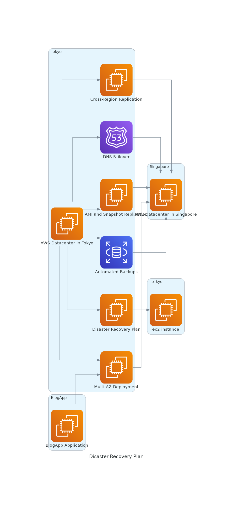

# AWS Disaster Recovery Plan Diagram

This Python script generates a diagram illustrating an AWS disaster recovery plan using the `diagrams` library. The diagram showcases the architecture and components involved in the plan, including AWS datacenters, cross-region replication, multi-AZ deployment, automated backups, AMI and snapshot replication, DNS failover, and regular testing.

## Prerequisites

- Python 3.x
- `diagrams` library (install using `pip install diagrams`)
### Note: underlying library diagrams relies on Graphviz's dot executable to render the diagrams. When you attempt to run your Python script, it's unable to find the dot executable in the system's PATH and Check if dot is in your PATH: Run the script in python virtual env if getting error in normal terminal.

  $ sudo apt-get install graphviz
  $ Which dot

 $ pip install virtualenv
 $ virtualenv myenv
 $ source myenv/bin/activate
 $ pip install diagrams

## Usage

1. Clone the repository or download the `dr_plan.py` script.
2. Install the `diagrams` library by running `pip install diagrams`.
3. Run the script using the command `python3 dr_plan.py`.
4. The diagram will be generated and displayed in the output.

## Customization

The script can be customized to match your specific disaster recovery plan. You can modify the nodes, edges, and their labels in the script to represent your AWS infrastructure and recovery components.

## Example Diagram

